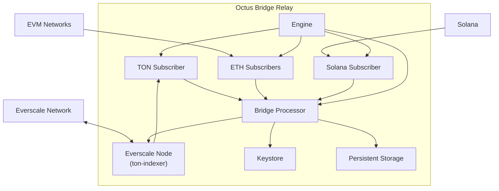

# Octus Bridge Relay

A high-performance relay node for [Octus Bridge](https://octusbridge.io/) that validates cross-chain transfer events across Everscale, EVM-compatible networks, and Solana. The relay operates as a full Everscale node, observes bridge contracts, verifies event data, and signs or rejects events on behalf of a registered staker.

## Table of Contents

- [Overview](#overview)
- [Features](#features)
- [System Requirements](#system-requirements)
- [Project Structure](#project-structure)
- [Getting Started](#getting-started)
- [Configuration](#configuration)
- [CLI Reference](#cli-reference)
- [Architecture](#architecture)
- [Monitoring](#monitoring)
- [Development](#development)
- [Changelog](#changelog)
- [License](#license)

## Overview

Octus Bridge Relay is the off-chain component that participates in the Octus Bridge consensus. Each relay instance:

1. Synchronizes an embedded Everscale node and indexes bridge contract state.
2. Subscribes to connector and event-configuration contracts on Everscale.
3. Monitors configured EVM chains and Solana for inbound transfer events.
4. Validates event payloads according to bridge ABI rules.
5. Signs valid events or sends rejection messages back to the bridge.

Running the relay as a dedicated Everscale node ensures low-latency event observation and coordinated voting within a single masterchain block.

## Features

- **Multi-chain support** — Everscale, any configured EVM network, and Solana
- **Embedded Everscale node** — Built on `ton-indexer` and `everscale-network` for direct chain access
- **Encrypted keystore** — ETH and TON keys stored with ChaCha20-Poly1305 encryption
- **Prometheus metrics** — Built-in exporter for operational visibility
- **Flexible deployment** — Native systemd service or Docker container
- **Hot reload** — Logger and metrics settings reload on `SIGHUP`
- **Staking integration** — Optional participation in relay elections (Everscale/Venom builds)

## System Requirements

| Resource | Minimum |
|----------|---------|
| CPU      | 8 cores @ 2 GHz |
| RAM      | 16 GB |
| Storage  | 200 GB fast SSD |
| Network  | 100 Mbit/s |

> Deployment scripts are tested on **Ubuntu 20.04**. Other distributions may require minor script adjustments.

## Project Structure

```
octusbridge-relay/
├── Cargo.toml                  # Rust package manifest (v2.3.6)
├── Cargo.lock                  # Dependency lockfile
├── Dockerfile                  # Multi-stage Docker build
├── LICENSE
├── README.md
│
├── contrib/                    # Deployment artifacts
│   ├── config.yaml             # Default relay configuration template
│   ├── relay.native.service    # systemd unit for native installs
│   └── relay.docker.service    # systemd unit for Docker installs
│
├── scripts/                    # Operational helper scripts (Ubuntu)
│   ├── setup.sh                # Install relay (native or docker)
│   ├── generate.sh             # Generate encrypted keystore
│   ├── export.sh               # Export keys from keystore
│   └── update.sh               # Update relay binary / image
│
└── src/
    ├── main.rs                 # CLI entry point (run, generate, export)
    ├── lib.rs                  # Library root
    │
    ├── config/                 # Application configuration
    │   ├── mod.rs              # AppConfig, BridgeConfig, NodeConfig
    │   ├── eth_config.rs       # EVM network settings
    │   ├── sol_config.rs       # Solana network settings
    │   ├── stored_keys.rs      # Encrypted keystore format
    │   └── verification_state.rs
    │
    ├── engine/                 # Core relay engine
    │   ├── mod.rs              # Engine orchestration and metrics
    │   ├── bridge/             # Bridge contract observer and event processor
    │   ├── eth_subscriber/     # EVM chain log polling and verification
    │   │   ├── StakingRelayVerifier.sol
    │   │   └── StakingRelayVerifier.abi
    │   ├── sol_subscriber/     # Solana event polling
    │   ├── ton_subscriber/     # Everscale contract state subscription
    │   ├── keystore/           # ETH / TON key management and signing
    │   ├── staking/            # Relay elections and round participation
    │   ├── ton_meta/           # TON token metadata client (TON builds)
    │   └── ton_contracts/      # Bridge smart-contract bindings
    │       ├── bridge_contract.rs
    │       ├── connector_contract.rs
    │       ├── base_event_contract.rs
    │       ├── base_event_configuration_contract.rs
    │       ├── eth_ton_event_contract.rs
    │       ├── eth_ton_event_configuration_contract.rs
    │       ├── ton_eth_event_contract.rs
    │       ├── ton_eth_event_configuration_contract.rs
    │       ├── sol_ton_event_contract.rs
    │       ├── sol_ton_event_configuration_contract.rs
    │       ├── ton_sol_event_contract.rs
    │       ├── ton_sol_event_configuration_contract.rs
    │       ├── staking_contract.rs
    │       ├── elections_contract.rs
    │       ├── relay_round_contract.rs
    │       ├── user_data_contract.rs
    │       ├── token_root_contract.rs
    │       ├── token_wallet_contract.rs
    │       └── tests.rs
    │
    ├── storage/                # Persistent and runtime state
    │   ├── mod.rs              # RocksDB-backed event storage
    │   └── tables.rs           # Database table definitions
    │
    └── utils/                  # Shared utilities
        ├── eth_address.rs
        ├── existing_contract.rs
        ├── memory_cache.rs
        ├── pending_messages_queue.rs
        ├── retry.rs
        ├── serde_helpers.rs
        ├── shard_utils.rs
        ├── tristate.rs
        └── tx_context.rs
```

### Runtime Paths (Production)

After running `setup.sh`, the following paths are used on the host:

| Path | Purpose |
|------|---------|
| `/etc/relay/config.yaml` | Relay configuration |
| `/etc/relay/keys.json` | Encrypted keystore |
| `/etc/relay/adnl-keys.json` | Temporary ADNL node keys |
| `/etc/relay/ton-global.config.json` | Everscale global network config |
| `/var/db/relay` | Everscale node database |
| `/var/db/relay-events` | Persistent event storage |

## Getting Started

### 1. Install the relay service

Choose one deployment method:

**Native** (recommended for production — lower overhead, better performance):

```bash
./scripts/setup.sh -t native
```

**Docker** (simpler setup, higher resource overhead):

```bash
./scripts/setup.sh -t docker
```

This creates a `relay` systemd service. Configuration and keys are placed under `/etc/relay`; the Everscale node database is stored at `/var/db/relay`.

> **Do not start the service yet.**

### 2. Configure environment

Set required variables in the systemd unit at `/etc/systemd/system/relay.service` (recommended — keeps secrets out of the config file):

```ini
[Service]
Environment=RELAY_MASTER_KEY=your-master-key
Environment=RELAY_STAKER_ADDRESS=your-staker-address
Environment=ETH_MAINNET_URL=https://your-eth-rpc-endpoint
Environment=POLYGON_URL=https://your-polygon-rpc-endpoint
```

Alternatively, replace `${VAR}` placeholders directly in `/etc/relay/config.yaml`.

### 3. Generate keys

```bash
./scripts/generate.sh -t native   # or -t docker
```

Add the `-i` flag to import existing seed phrases instead of generating new ones.

The script outputs unencrypted key material. **Record it securely and back up `/etc/relay`.**

### 4. Link relay to your staker

Register the relay's ETH address and Everscale public key at [octusbridge.io/relayers/create](https://octusbridge.io/relayers/create). Start the relay (step 5) during the linking process so it can confirm ownership on-chain.

- Initial sync takes approximately **40 minutes**.
- Send at least **0.05 ETH** to the relay's ETH address for ownership confirmation.
- Gas thresholds are configurable in `config.yaml` if network fees are elevated.

### 5. Start the service

```bash
sudo systemctl enable relay
sudo systemctl start relay

# Verify startup — look for "initialized relay" in logs
sudo journalctl -fu relay
```

Ensure **UDP port 30000** (default ADNL port) is open in your firewall.

For Docker deployments, pass all environment variables to the container (e.g. `-e RELAY_MASTER_KEY`) and update the unit file if you change the exposed port.

## Configuration

Environment variable substitution is supported throughout the config file using `${VAR}` syntax.

See [`contrib/config.yaml`](contrib/config.yaml) for the canonical template. Key sections:

| Section | Description |
|---------|-------------|
| `master_password` | Keystore encryption password |
| `staker_address` | Registered staker address |
| `bridge_settings` | Bridge contract, keys, EVM/Solana networks |
| `node_settings` | Everscale node DB path, ADNL port, RocksDB options |
| `storage` | Persistent event database path |
| `metrics_settings` | Prometheus exporter bind address and path |

<details>
<summary><strong>Full example configuration</strong></summary>

```yaml
---
master_password: "${RELAY_MASTER_KEY}"
staker_address: "${RELAY_STAKER_ADDRESS}"
bridge_settings:
  keys_path: "/etc/relay/keys.json"
  bridge_address: "0:1d51fb47566d0d283ebbf83c641c01ebebaad6c3cec55895b0074b802036094e"
  ignore_elections: false
  shard_split_depth: 10
  token_meta_base_url: "https://ton-tokens-api.meta"
  sol_network:
    endpoints: ["https://api.mainnet-beta.solana.com"]
    poll_interval_sec: 30
  evm_networks:
    - chain_id: 1
      endpoint: "${ETH_MAINNET_URL}"
      get_timeout_sec: 10
      blocks_processing_timeout_sec: 120
      pool_size: 10
      poll_interval_sec: 60
      max_block_range: 1000
    - chain_id: 56
      endpoint: https://bsc-dataseed1.binance.org
      get_timeout_sec: 10
      pool_size: 10
      poll_interval_sec: 60
      max_block_range: 1000
    - chain_id: 250
      endpoint: https://rpc.ftm.tools
      get_timeout_sec: 10
      pool_size: 10
      poll_interval_sec: 60
      max_block_range: 1000
    - chain_id: 137
      endpoint: "${POLYGON_URL}"
      get_timeout_sec: 10
      pool_size: 10
      poll_interval_sec: 60
      max_block_range: 1000
    - chain_id: 2001
      endpoint: https://rpc-mainnet-cardano-evm.c1.milkomeda.com
      get_timeout_sec: 10
      pool_size: 10
      poll_interval_sec: 60
      maximum_failed_responses_time_sec: 604800
      max_block_range: 1000
    - chain_id: 43114
      endpoint: https://api.avax.network/ext/bc/C/rpc
      get_timeout_sec: 10
      pool_size: 10
      poll_interval_sec: 60
      maximum_failed_responses_time_sec: 604800
      max_block_range: 1000
    - chain_id: 8217
      endpoint: https://klaytn.blockpi.network/v1/rpc/public
      get_timeout_sec: 10
      pool_size: 10
      poll_interval_sec: 60
      maximum_failed_responses_time_sec: 604800
      max_block_range: 5000
node_settings:
  db_path: "/var/db/relay"
  adnl_port: 30000
  temp_keys_path: "/etc/relay/adnl-keys.json"
  db_options:
    rocksdb_lru_capacity: "2 GB"
    cells_cache_size: "4 GB"
  adnl_options:
    force_use_priority_channels: false
storage:
  persistent_db_path: "/var/db/relay-events"
metrics_settings:
  listen_address: "127.0.0.1:10000"
  metrics_path: "/metrics"
  collection_interval_sec: 10
```

</details>

## CLI Reference

The `relay` binary exposes three subcommands:

```bash
# Start the relay node
relay run --config /etc/relay/config.yaml --global-config /etc/relay/ton-global.config.json

# Generate a new encrypted keystore
relay generate /etc/relay/keys.json --config /etc/relay/config.yaml
relay generate /etc/relay/keys.json -i   # import from existing seed phrases

# Export keys from keystore (JSON output)
relay export /etc/relay/keys.json --config /etc/relay/config.yaml
```

The `scripts/` directory wraps these commands for systemd-managed deployments.

## Architecture



### Startup sequence

1. Synchronize the Everscale node and download blockchain state.
2. Scan bridge contract state for connectors, active configurations, and pending events.
3. Subscribe to the bridge contract and listen for new connector deployments.
4. Subscribe to each active event-configuration contract.
5. Start EVM and Solana subscribers for inbound event verification.

### Event verification

**Everscale → EVM** — The relay validates data packing correctness (on-chain contracts handle additional checks). Optional token metadata verification is available for TON (contract flag `0x01`). Valid events are ABI-encoded and signed with the relay's ETH key; invalid events trigger a rejection message.

| Everscale type | EVM mapping |
|----------------|-------------|
| `bytes`, `string`, `uintX`, `intX`, `bool`, `fixedbytes` | Same |
| `fixedarray`, `array`, `tuple` | Same, recursively mapped |
| Other | Unsupported |

**EVM → Everscale** — The relay fully verifies event parameters, locates the source transaction on the target EVM network, converts data to a TVM cell, and sends a confirmation or rejection message.

Use the [eth-ton-abi-converter](https://github.com/broxus/eth-ton-abi-converter) tool to convert ABI definitions.

| EVM type | Everscale mapping |
|----------|-------------------|
| `address` | `bytes` (20 bytes) |
| `bytes` | `bytes` or `cell` (*) |
| `string`, `intX`, `uintX`, `bool` | Same |
| `fixedbytes1` | Context flags (**) |
| `fixedbytesX` | Same |
| `array`, `fixedarray`, `tuple` | Same, recursively mapped or `cell` (***) |
| Other | Unsupported |

Context flags (set via a `bytes1` element):

| Flag | Effect |
|------|--------|
| `0x01` | Place tuples in a new cell (***) |
| `0x02` | Interpret `bytes` as encoded TVM cell (*) |
| `0x04` | Insert default cell on error when `0x02` is set (*) |
| `0x08` | Verify token root for token wallet |

> Flags cannot be changed inside array elements — doing so produces inconsistent ABI items.

### Design rationale

Earlier relay versions depended on shared light nodes or GraphQL endpoints, which caused reliability issues and delayed event observation. Embedding a full Everscale node allows relays to observe and vote on events within the same masterchain block, with a Rust implementation that is more resource-efficient than the C++ reference node.

## Monitoring

The relay exposes Prometheus metrics (configured via `metrics_settings`). Default endpoint:

```
http://127.0.0.1:10000/metrics
```

<details>
<summary><strong>Sample metrics output</strong></summary>

```
eth_subscriber_last_processed_block{staker="0:7a97...",chain_id="1"} 13875962
eth_subscriber_pending_confirmation_count{staker="0:7a97...",chain_id="1"} 0
ton_subscriber_ready{staker="0:7a97..."} 1
ton_subscriber_mc_block_seqno{staker="0:7a97..."} 13426600
bridge_pending_eth_ton_event_count{staker="0:7a97..."} 0
bridge_pending_ton_eth_event_count{staker="0:7a97..."} 0
bridge_total_active_eth_ton_event_configurations{staker="0:7a97..."} 86
staking_current_relay_round{staker="0:7a97..."} 13
staking_elected{staker="0:7a97...",round_num="13"} 1
```

</details>

Send `SIGHUP` to reload logger and metrics exporter settings without restarting the process.

## Development

### Build from source

```bash
# Requires Rust 1.56+ and LLVM/Clang
cargo build --release

# Everscale/Venom build (default feature set)
cargo build --release --features venom

# TON network build
cargo build --release --features ton
```

### Cargo features

| Feature | Description |
|---------|-------------|
| `venom` | Everscale/Venom network (default in `.deb` packages) |
| `ton` | TON network with double-broadcast and token metadata |
| `disable-staking` | Disable staking and elections (enabled by `ton` feature) |
| `double-broadcast` | Duplicate message broadcast via JRPC (enabled by `ton` feature) |

### Run locally

```bash
relay run -c contrib/config.yaml -g /path/to/ton-global.config.json
```

### Update deployed relay

```bash
./scripts/update.sh -t native   # or -t docker
```

## Changelog

### 2.3.6

- TON network relay support with ABI 2.3
- Token root verification for TVM networks
- Optional double-broadcast via JRPC for TON builds
- TON token metadata verification for TON→ETH events

### 2.3.2 (2024-03-07)

**Features**

- Close expired Solana events
- Improve Solana metrics

**Bugfixes**

- Fixed clearing Solana events from pending buffer

### 2.3.1 (2024-02-08)

**Features**

- Improved shard states GC

**Bugfixes**

- Fixed Solana events parsing

### 2.3.0 (2024-01-08)

**Features**

- Fully reworked bridge with Solana

### 2.2.0 (2023-04-04)

**Bugfixes**

- Stability fixes

### 2.1.2 (2022-12-23)

**Features**

- Improved logger
- Added support for configuration feature flags
- Extend rejection info

**Bugfixes**

- Fixed transport issues

### 2.1.1 (2022-10-14)

**Bugfixes**

- Fixed errors with SOL events during scanning all events
- Increased default polling interval

### 2.1.0 (2022-09-06)

**Features**

- Add Solana

**Bugfixes**

- Fixed outgoing RLDP transfers

### 2.0.13 (2022-07-22)

**Features**

- Replace `tiny-adnl` with `everscale-network`
- Optimize DB layout

### 2.0.12 (2022-06-03)

**Features**

- Backport transport fixes

### 2.0.11 (2022-04-13)

**Features**

- Added archives assembly
- Added new account model support

**Bugfixes**

- Fixed ADNL channels

### 2.0.10 (2022-04-03)

**Bugfixes**

- Fixed memory leaks (new peers queue was read at a fixed rate)

### 2.0.9 (2022-03-26)

**Features**

- Added packets compression support (enabled by default)
- Various optimizations

### 2.0.8 (2022-02-12)

**Features**

- Updated ABI version to 2.2
- Fixed memory leaks (shard states were slowly filling with loaded storage cells)

### 2.0.7 (2022-02-02)

**Features**

- ADNL security improvements

### 2.0.6 (2021-12-31)

**Features**

- Optimized DB structure

### 2.0.5 (2021-11-27)

**Features**

- Improved ETH events verification
- Updated events ABI
- Added `ton_subscriber_shard_client_time_diff`, `ton_subscriber_mc_block_seqno`, and `ton_subscriber_shard_client_mc_block_seqno` metrics

### 2.0.4 (2021-11-11)

**Features**

- Use jemalloc by default

**Bugfixes**

- Fixed blocks GC memory issues

### 2.0.3 (2021-11-09)

**Features**

- Hot reload for metrics exporter and logger settings (SIGHUP signal)
- Blocks and states garbage collection
- Additional EVM RPC timing controls
- Improved database layout and increased data locality

**Bugfixes**

- Fixed exported metrics format
- Fixed event confirmation counters
- Fixed time diff metrics
- Reduced blocks range for `eth_getLogs`
- Ignore descending blocks for ETH RPC

### 2.0.2

**Features**

- Added setup scripts for fast deployment

**Bugfixes**

- Fixed bridge contracts interaction logic according to new changes

### 2.0.1

Initial release.

## License

See [LICENSE](LICENSE).
